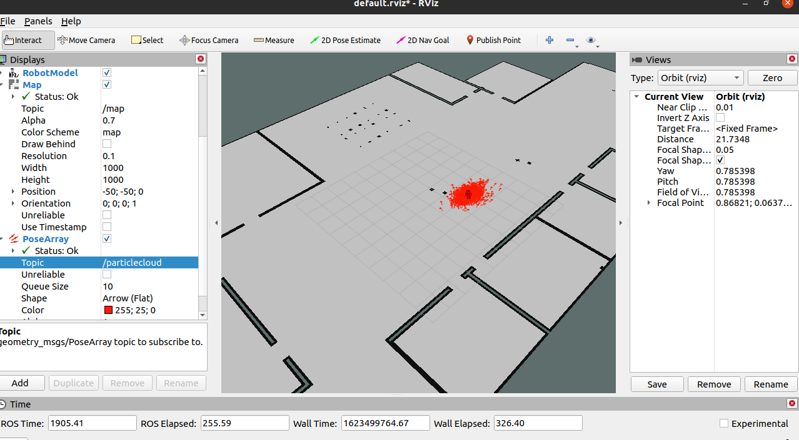
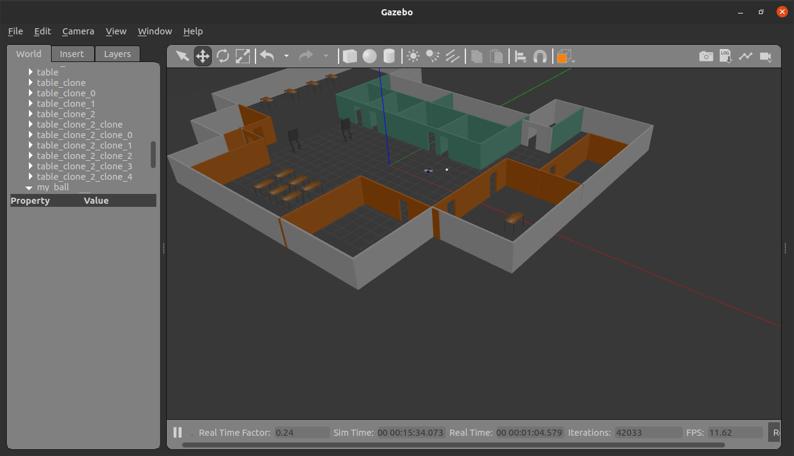

# Screenshot robot localizing in simulation 

# Go chase it (ROS)
In this project, I learned the fundamentals of ROS by making a ball chasing robot that uses a camera feed to figure out and compute the ball's location and moves the robot towards it. 

# Technologies used

- Gazebo 
- RViz 
- URDF 
- Lidar plugin 
- Camera plugin 
- roscpp 
